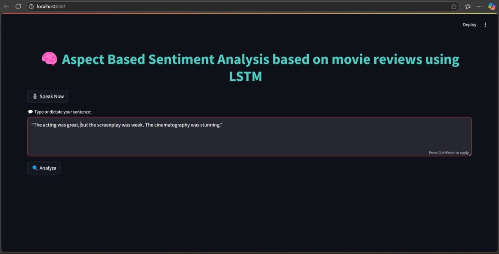

# Sentiment_Analysis

1]Install the required Python packages using:
pip install -r requirements.txt

2]Also, download the English language model for spaCy
python -m spacy download en_core_web_sm

3] Voice Input (Note)
If using microphone input, make sure your environment supports it. You may need to install:
sudo apt-get install portaudio19-dev

4]Running the App
After installing the requirements and downloading the language model:
streamlit run app.py

#OUTPUT

